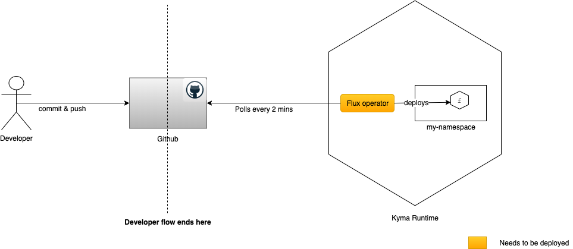

# Overview

Gitops flow for Kyma lambdas.

## Prerequisites

* kubectl
* make

## Flow

* Define a lambda function under `lambdas` directory.

    ```shell
    sample-lambda
    ├── package.json
    └── sample-lambda.js

    0 directories, 2 files
    ```

    `sample-lambda.js` contains the nodejs based function definition.
    `package.json` contains the required npm dependencies.

    > Note: Name of the .js file and directory should be same.
* Create the kubernetes configuration. e.g.

    ```shell
    make create-function NAME=sample-lambda NS=demo-flux
    ```

    `NAME`: Name of the Kyma lambda.
    `NS`: Namespace in whcih lambda will be deployed.

    This will create the kubernetes config yaml under [resources/lambdas](../../resources/lambdas/) directory.
* Push the code changes to the repository.
* The changes are automatically picked up by the flux operator and applied to the running Kyma cluster.
* The lambda will be created in the Kyma cluster.


